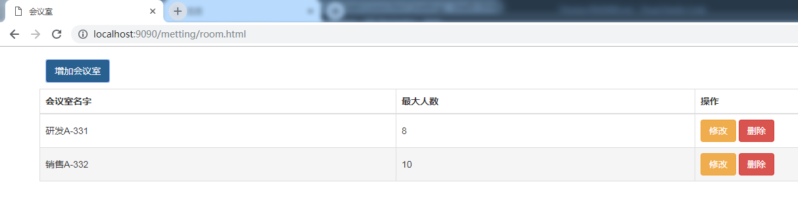
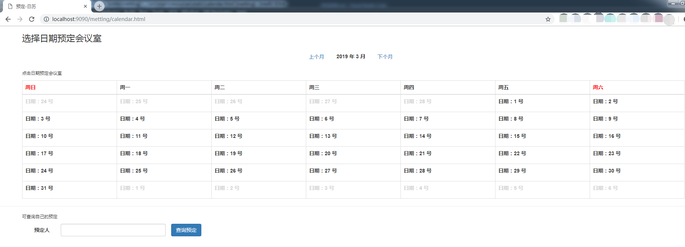
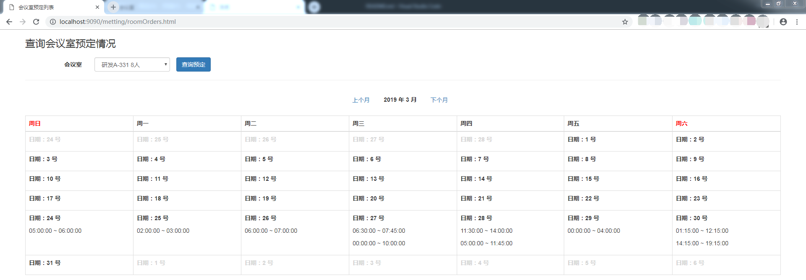

# 会议室预定

## 一、部署和代码说明

### 1. 部署启动说明

#### 1.1 部署

java环境，JDK11

maven打包，生成 `metting-1.0-SNAPSHOT-all.tar.gz`，解压后目录：

```txt
|--conf
|--lib
|--start.cmd
|--start.sh
```

- conf：存放配置文件和html
- lib：都是jar包
- 启动脚本

#### 1.2 启动

启动之后根目录下生成文件：

- application.pid文件，内容是本次启动的pid
- log文件夹，存放日志
- H2，存放数据库文件

### 2. 代码说明

- 后端：springboot、jpa
- h2数据库：持久化，根目录下生成H2目录存放数据
- 页面：bootstrap+jquery

## 二、使用说明

### 1. 会议室管理

http://localhost:9090/metting/room.html



### 2. 预定管理

http://localhost:9090/metting/calendar.html



### 3. 按照会议室查询预定

http://localhost:9090/metting/roomOrders.html

